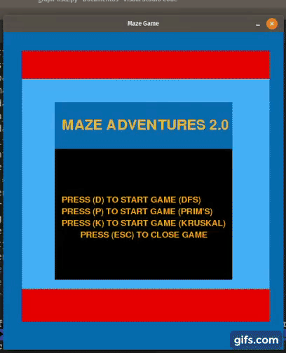
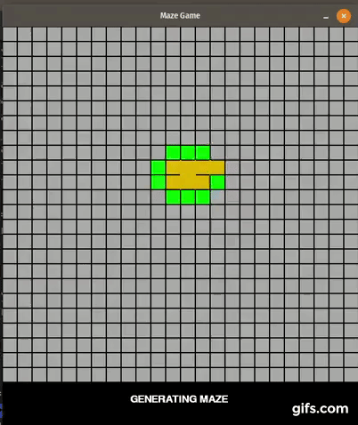
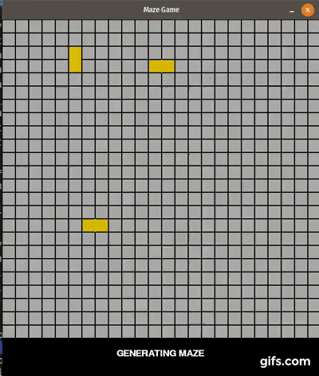
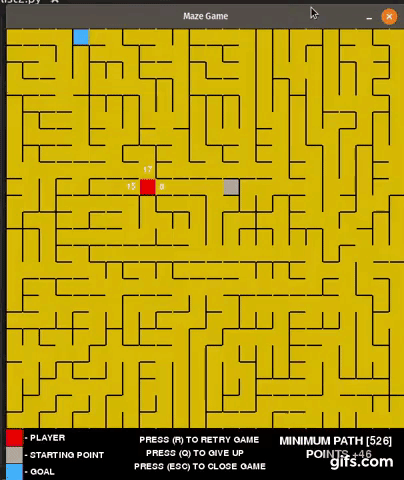

# <p align="center">Maze Adventures 2.0: Maze Game using Depth-First Search, Prim Algorithm, Kruskal Algorithm to Generate Maze and Dijkstra Algorithm to Solve Maze </p>

## Autors

| Name  | University Registration  | GitHub | Email |
|---|---|---|---|
| Daniel Maike Mendes Gonçalves  | 16/0117003  | [DanMke](https://github.com/DanMke) | danmke@hotmail.com |
| Lucas Pereira de Andrade Macêdo  | 15/0137397  | [lukassxp](https://github.com/lukassxp) | lpalucas.10@gmail.com |

## Installation

> * ``` git clone https://github.com/projeto-de-algoritmos/Graphs-List2-DanielGoncalves-LucasMacedo.git ``` <br> <br>
> * ``` pip3 install -r requirements.txt --user ```

## Execution

> * ``` python3 graph-list2.py ```

## About Maze

<p align="justify"> A maze is a path or collection of paths, typically from an entrance to a goal. 
The word is used to refer both to branching tour puzzles through which the solver must find a route, 
and to simpler non-branching patterns that lead unambiguously through a convoluted layout to a goal. </p>

### Generating Mazes

<p align="justify"> Maze generation is the act of designing the layout of passages and walls within a maze. 
There are many different approaches to generating mazes, with various maze generation algorithms for building them, 
either by hand or automatically by computer.
There are two main mechanisms used to generate mazes. 
In "carving passages", one marks out the network of available routes. In building a maze by "adding walls", 
one lays out a set of obstructions within an open area. Most mazes drawn on paper are done by drawing the walls, 
with the spaces in between the markings composing the passages. </p>

### Solving Mazes

<p align="justify"> Maze solving is the act of finding a route through the maze from the start to finish. 
Some maze solving methods are designed to be used inside the maze by a traveler with no prior knowledge of the maze, 
whereas others are designed to be used by a person or computer program that can see the whole maze at once.
The mathematician Leonhard Euler was one of the first to analyze plane mazes mathematically, 
and in doing so made the first significant contributions to the branch of mathematics known as topology.
Mazes containing no loops are known as "standard", or "perfect" mazes, and are equivalent to a tree in graph theory. 
Thus many maze solving algorithms are closely related to graph theory. Intuitively, 
if one pulled and stretched out the paths in the maze in the proper way, the result could be made to resemble a tree. </p>

## Maze Adventures

### Maze generation algorithm

#### Recursive backtracker using Depth-First Search

- 1. Make the initial cell the current cell and mark it as visited <br>
- 2. While there are unvisited cells <br>
    - 1. If the current cell has any neighbours which have not been visited <br>
        - 1. Choose randomly one of the unvisited neighbours <br>
        - 2. Push the current cell to the stack <br>
        - 3. Remove the wall between the current cell and the chosen cell <br>
        - 4. Make the chosen cell the current cell and mark it as visited <br>
    - 2. Else if stack is not empty <br>
        - 1. Pop a cell from the stack <br>
        - 2. Make it the current cell <br>



#### Prim algorithm

- 1. Make the initial cell and mark it as visited <br>
- 2. While there are unvisited cells <br>
- 3. Escolhe um nó que já foi visitado e que tenha ao menos um vizinho não visitado <br>
    - 1. Escolhe um vizinho aleatório que não tenha sido visitado <br>
        - 1. Marca a conexão entre o atual e o vizinho e o peso para a aresta
        - 2. Remove a parede entre o atual e o vizinho escolhido



#### Kruskal algorithm

- 1. Cada nó é iniciado com um id diferente e único <br>
- 2. Enquanto o id de todos os nós do grafo não forem iguais <br>
    - 1. Escolhe um nó que possui ao menos um vizinho com id diferente <br>
        - 1. Escolhe um vizinho que não tenha id igual <br>
            - 1. Marca a conexão entre o atual e o vizinho e o peso para a aresta <br>
            - 2. Remove a parede entre o atual e o vizinho escolhido <br>
            - 3. Iguala o id do vizinho ao id do atual <br>
                - 1. Faça de todos os nós iguais ao id do vizinho iguais ao id do atual <br>



### Maze solving algorithm

#### Dijkstra algorithm

- 1. Make the initial cell and mark it as explored <br>
- 2. Marque a distância para a célula inicial igual a zero e igual a infinito para as outras células
- 3. While there are not exploited cells <br>
    - 1. Escolha o nó de menor distância dentre os não explorados <br>
    - 2. Marque-o como explorado <br>
    - 3. Para todo vizinho do nó escolhido <br>
        - 1. Pega a distância até o pai <br>
        - 2. Soma a distância do pai com o vizinho escolhido <br>
        - 3. Verifica se é menor que a distância que já está no vizinho escolhido <br>
            - 1. Se for menor, substitua <br>



## References

> * https://gifs.com/ <br>
> * https://en.wikipedia.org/wiki/Maze <br>
> * https://en.wikipedia.org/wiki/Maze_generation_algorithm <br>
> * https://en.wikipedia.org/wiki/Maze_solving_algorithm <br>
> * https://wiki.hurna.io/algorithms/maze_generator/kruskal_s.html <br>
> * https://wiki.hurna.io/algorithms/maze_generator/prim_s.html <br>
> * https://courses.cs.washington.edu/courses/cse326/07su/prj2/kruskal.html <br>
> * https://weblog.jamisbuck.org/2011/1/3/maze-generation-kruskal-s-algorithm.html <br>
> * https://weblog.jamisbuck.org/2011/1/10/maze-generation-prim-s-algorithm.html
