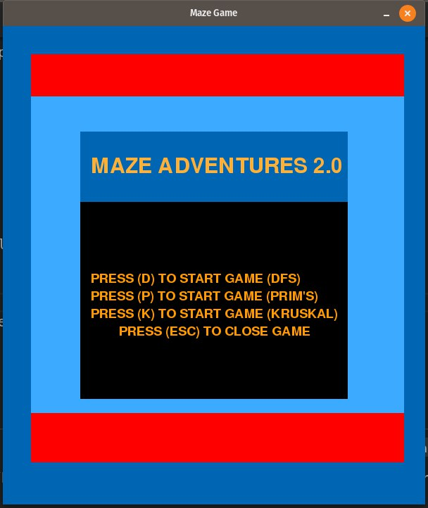

# <p align="center">Maze Adventures 2.0: Maze Game using Depth-First Search, Prim Algorithm, Kruskal Algorithm to Generate Maze and Dijkstra Algorithm to Solve Maze </p>

## Autors

| Name  | University Registration  | GitHub | Email |
|---|---|---|---|
| Daniel Maike Mendes Gonçalves  | 16/0117003  | [DanMke](https://github.com/DanMke) | danmke@hotmail.com |
| Lucas Pereira de Andrade Macêdo  | 15/0137397  | [lukassxp](https://github.com/lukassxp) | lpalucas.10@gmail.com |

## Installation

> * ``` git clone https://github.com/projeto-de-algoritmos/Graphs-List2-DanielGoncalves-LucasMacedo.git ``` <br> <br>
> * ``` pip3 install -r requirements.txt --user ```

## Execution

> * ``` python3 graph-list2.py ```

## About Maze

<p align="justify"> A maze is a path or collection of paths, typically from an entrance to a goal. 
The word is used to refer both to branching tour puzzles through which the solver must find a route, 
and to simpler non-branching patterns that lead unambiguously through a convoluted layout to a goal. </p>

### Generating Mazes

<p align="justify"> Maze generation is the act of designing the layout of passages and walls within a maze. 
There are many different approaches to generating mazes, with various maze generation algorithms for building them, 
either by hand or automatically by computer.
There are two main mechanisms used to generate mazes. 
In "carving passages", one marks out the network of available routes. In building a maze by "adding walls", 
one lays out a set of obstructions within an open area. Most mazes drawn on paper are done by drawing the walls, 
with the spaces in between the markings composing the passages. </p>

### Solving Mazes

<p align="justify"> Maze solving is the act of finding a route through the maze from the start to finish. 
Some maze solving methods are designed to be used inside the maze by a traveler with no prior knowledge of the maze, 
whereas others are designed to be used by a person or computer program that can see the whole maze at once.
The mathematician Leonhard Euler was one of the first to analyze plane mazes mathematically, 
and in doing so made the first significant contributions to the branch of mathematics known as topology.
Mazes containing no loops are known as "standard", or "perfect" mazes, and are equivalent to a tree in graph theory. 
Thus many maze solving algorithms are closely related to graph theory. Intuitively, 
if one pulled and stretched out the paths in the maze in the proper way, the result could be made to resemble a tree. </p>

## Maze Adventures

### Maze generation algorithm

 <br>
It is possible to choose between three maze generation algorithms

#### Recursive backtracker using Depth-First Search

- 1. Make the initial cell the current cell and mark it as visited <br>
- 2. While there are unvisited cells <br>
    - 1. If the current cell has any neighbours which have not been visited <br>
        - 1. Choose randomly one of the unvisited neighbours <br>
        - 2. Push the current cell to the stack <br>
        - 3. Remove the wall between the current cell and the chosen cell <br>
        - 4. Make the chosen cell the current cell and mark it as visited <br>
    - 2. Else if stack is not empty <br>
        - 1. Pop a cell from the stack <br>
        - 2. Make it the current cell <br>


#### Prim algorithm

- 1. Make the initial cell and mark it as visited <br>
- 2. While there are unvisited cells <br>
- 3. Choose a node that has already been visited and has at least one unvisited neighbor <br>
    - 1. Choose a random neighbor who has not been visited <br>
        - 1. Mark the connection between the current and the neighbor and the weight for the edge
        - 2. Removes the wall between the current and the chosen neighbor


#### Kruskal algorithm

- 1. Each node is started with a unique and unique id <br>
- 2. As long as the id of all nodes in the graph are not equal <br>
    - 1. Choose a node that has at least one neighbor with different id <br>
        - 1. Choose a neighbor who does not have equal id <br>
            - 1. Mark the connection between the current and the neighbor and the weight for the edge <br>
            - 2. Removes the wall between the current and the chosen neighbor <br>
            - 3. Equals the neighbor's id to the current id <br>
                - 1. Make all nodes equal to the id of the neighbor equal to the id of the current <br>


### Maze solving algorithm

#### Dijkstra algorithm

- 1. Make the initial cell and mark it as explored <br>
- 2. Mark the distance to the starting cell equal to zero and equal to infinity for the other cells
- 3. While there are not exploited cells <br>
    - 1. Choose the node with the shortest distance from the unexplored <br>
    - 2. Mark it as scanned <br>
    - 3. For every neighbor of the chosen node <br>
        - 1. Take the distance to the father <br>
        - 2. Sum the distance of the father with the chosen neighbor <br>
        - 3. Checks if it is less than the distance that is already in the chosen neighbor <br>
            - 1. If smaller, replace <br>


## References

> * https://gifs.com/ <br>
> * https://en.wikipedia.org/wiki/Maze <br>
> * https://en.wikipedia.org/wiki/Maze_generation_algorithm <br>
> * https://en.wikipedia.org/wiki/Maze_solving_algorithm <br>
> * https://wiki.hurna.io/algorithms/maze_generator/kruskal_s.html <br>
> * https://wiki.hurna.io/algorithms/maze_generator/prim_s.html <br>
> * https://courses.cs.washington.edu/courses/cse326/07su/prj2/kruskal.html <br>
> * https://weblog.jamisbuck.org/2011/1/3/maze-generation-kruskal-s-algorithm.html <br>
> * https://weblog.jamisbuck.org/2011/1/10/maze-generation-prim-s-algorithm.html
